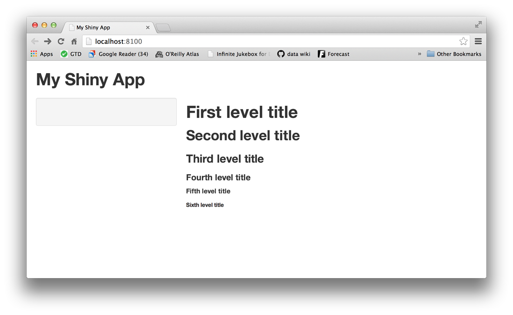

```{r setup, include=FALSE}
knitr::opts_chunk$set(echo = TRUE)
```
##使用Shiny进行交互式数据可视化

原文链接：https://www.bioconductor.org/help/course-materials/2015/CSAMA2015/lab/shiny.html; http://shiny.rstudio.com/tutorial/


####1. 了解Shiny

shiny是R的一个包，方便用来直接构建网页应用(apps)。包里面同时含有11个例子来演示Shiny如何工作，每个例子都可以作为应用来看待。


"Hello Shiny"例子绘制R里面的faithful数据集的直方图，同时可以调节组距的数量。用户可以通过滑条来改变组距的数量，应用会立刻对用户的输入作出反应。你可以使用"Hello Shiny"探索Shiny应用的架构并且创造出你的第一个应用。


要运行"Hello Shiny"，输入：
```{r}
library(shiny)
runApp("01_hello")
```


会出现如下显示结果：


#####1.1 Shiny应用的架构

Shiny应用有两个组件：
  
  * 用户界面脚本
  
  * 服务器脚本


用户界面(UI)脚本控制应用的布局和外观。它被定义在源文件ui.R。以下是"Hello Shiny"例子的ui.R脚本：
```{r}
library(shiny)

# Define UI for application that draws a histogram
shinyUI(fluidPage(

  # Application title
  titlePanel("Hello Shiny!"),

  # Sidebar with a slider input for the number of bins
  sidebarLayout(
    sidebarPanel(
      sliderInput("bins",
                  "Number of bins:",
                  min = 1,
                  max = 50,
                  value = 30)
    ),

    # Show a plot of the generated distribution
    mainPanel(
      plotOutput("distPlot")
    )
  )
))
```


server.R脚本包含构建应用你的电脑需要的指令。以下是"Hello Shiny"的server.R脚本文件：
```{r}
library(shiny)

# Define server logic required to draw a histogram
shinyServer(function(input, output) {

  # Expression that generates a histogram. The expression is
  # wrapped in a call to renderPlot to indicate that:
  #
  #  1) It is "reactive" and therefore should be automatically
  #     re-executed when inputs change
  #  2) Its output type is a plot

  output$distPlot <- renderPlot({
    x    <- faithful[, 2]  # Old Faithful Geyser data
    bins <- seq(min(x), max(x), length.out = input$bins + 1)

    # draw the histogram with the specified number of bins
    hist(x, breaks = bins, col = 'darkgray', border = 'white')
  })

})
```


从某种程度说，"Hello Shiny"的服务器脚本文件很简单。它仅仅做了些计算然后根据请求的组距数量来绘制直方图。


然而，你同时会注意到，大部分的脚本文件可以用renderplot调用。以上代码的注释里对其进行了解释。你会发现这个有点困惑，不过没关系，我们会更详细地解释它。


#####1.2 运行应用文件

每个Shiny应用有同样的架构：目录底下保存两个R脚本。每个应用最少有ui.R和server.R文件，你可以通过在一个新的目录底下保存ui.R和server.R来新建一个应用。每个Shiny应用都要有独立的目录。


你可以给函数runApp输入你要运行的Shiny应用的目录名字。例如，你的应用在my_app目录底下，你可以使用以下的命令运行它：
```{r}
library(shiny)
runApp("my_app")
```


笔记：runApp函数的第一个参数是你的工作目录到应用目录的文件路径。以上的代码假设你的应用目录在你的工作目录下。在这种情况，文件路径就是目录的名称。


"Hello Shiny"应用文件同时存储在特殊的系统路径下，以应对runExample响应。你可以有选择的使用以下命令运行应用：
```{r}
runApp(system.file(package="shiny", "examples", "01_hello"))
```


#####1.3 你可以试试

尝试新建你的第一个Shiny应用my_app。选择新项目-新目录-Shiny网页应用。项目会自动出现ui.R和server.R文件包含与"Hello Shiny"应用类似的代码。你可以在R控制台里输入以下命令启动你的应用：
```{r}
library(shiny)
runApp()
```


你同样可以选择点击运行应用按钮(在编辑器的最上面)，或者使用键盘快捷键：control+shift+enter(windows/linux)或者command+shift+enter(mac)。


你可以尝试在你的应用更改以下：
  
  * 更改标题为"Hello World"
  
  * 设置滑条的最小值为5
  
  * 更改直方图的颜色为"skyblue"
  

当你弄好后，重新启动你的应用，你的应用应该如下所示：


####2. 构建用户界面

现在尝试从头开始构建你的应用。我们会从展示用户界面开始。你需要学会如何布局用户界面并且添加HTML元素。


我们使用之前你建立的my_app。把server.R和ui.R修改为如下：


ui.R
```{r}
shinyUI(fluidPage())
```


server.R
```{r}
shinyServer(function(input, output) {})
```


#####2.1 布局

Shiny ui.R的脚本使用fluidPage函数创造显示，并且自动调整你的用户的浏览器窗口。你通过在fluidPage函数里添加元素来布局你的应用。

例如，以下的ui.R脚本新建一个用户界面，有一个小面板和滑条。

```{r}
# ui.R

shinyUI(fluidPage(
  titlePanel("title panel"),

  sidebarLayout(
    sidebarPanel("sidebar panel"),
    mainPanel("main panel")
  )
))
```


titlePanel和sidebarLayout是最常用的添加到fluidPage函数里的两个元素。他们新建一个带有滑条的基础Shiny应用。这些函数要么在滑条要么在主面板里写入内容。


你还可以创造更多高级的设计。比如使用navbarPage创造多页的用户界面。


#####2.2 HTML内容

你可以通过Panel函数添加内容到你的Shiny应用。例如，以上的应用在它每一个面板里面显示了一个字符串。要添加更高级的内容，可以使用Shiny的HTML标签函数。这些函数对应常见的HTML5标签。作为例子，我们尝试新建标题。


######2.2.1 标题

为了建立标题可以选择标题函数，例如h1或者h3。然后可以把你要写的文字放进去。如果要在你的应用里面放入元素，可以把它作为参数放入titlePanel，sidebarPanel或者mainPanel。你可以放入多个元素在同个面板，只要通过逗号分开即可。

如下：
```{r}
# ui.R

shinyUI(fluidPage(
  titlePanel("My Shiny App"),
  sidebarLayout(
    sidebarPanel(),
    mainPanel(
      h1("First level title"),
      h2("Second level title"),
      h3("Third level title"),
      h4("Fourth level title"),
      h5("Fifth level title"),
      h6("Sixth level title")
    )
  )
))
```


你的应用应该如下所示：



#####2.3 其他标签

我们已经展示了如何使用标题标签函数。但是还有更多的标签函数可以使用。
```{r}
names(tags)
```


新建一个标签，可以将tag的元素作为函数调用，例如，要创建div标签，可以使用：
```{r}
tags$div()
```


部分标签函数的名字与R的原生函数的名字冲突，所以你在使用的时候要用tags$加上标签名。


####3. 控件

现在是时候添加一些控件到你的应用里了。控件是用户可以交互的网页元素。控件从用户那里获得信息然后发送给你的应用。当用户调节控件，信息同时也改变了。标准的Shiny控件如下所示：


#####3.1 添加控件

你可以添加控件到用户界面通过将sidebarPanel或者mainPanel的控件函数放入你的ui.R文件。每个控件的前两个参数是：
 
  * 控件的名字
 
  * 标签


剩下的参数根据不同的控件而异。以下的代码可以实现之前的应用界面。你可以体验一下更改控件函数的值来实现不同的效果：
```{r}
# ui.R

shinyUI(fluidPage(
  titlePanel("Basic widgets"),
  
  fluidRow(
    
    column(3,
      h3("Buttons"),
      actionButton("action", label = "Action"),
      br(),
      br(), 
      submitButton("Submit")),
    
    column(3,
      h3("Single checkbox"),
      checkboxInput("checkbox", label = "Choice A", value = TRUE)),
    
    column(3, 
      checkboxGroupInput("checkGroup", 
        label = h3("Checkbox group"), 
        choices = list("Choice 1" = 1, "Choice 2" = 2, "Choice 3" = 3),
        selected = 1)),
    
    column(3, 
      dateInput("date", label = h3("Date input"), value = "2014-01-01"))   
  ),
  
  fluidRow(
    
    column(3,
      dateRangeInput("dates", label = h3("Date range"))),
    
    column(3,
      fileInput("file", label = h3("File input"))),
    
    column(3, 
      h3("Help text"),
      helpText("Note: help text isn't a true widget,", 
        "but it provides an easy way to add text to",
        "accompany other widgets.")),
    
    column(3, 
      numericInput("num", label = h3("Numeric input"), value = 1))   
  ),
    
  fluidRow(
    
    column(3,
      radioButtons("radio", label = h3("Radio buttons"),
        choices = list("Choice 1" = 1, "Choice 2" = 2, "Choice 3" = 3), selected = 1)),
    
    column(3,
      selectInput("select", label = h3("Select box"), 
        choices = list("Choice 1" = 1, "Choice 2" = 2, "Choice 3" = 3), selected = 1)),
    
    column(3, 
      sliderInput("slider1", label = h3("Sliders"), min = 0, max = 100, value = 50),
      sliderInput("slider2", "", min = 0, max = 100, value = c(25, 75))
      ),
    
    column(3, 
      textInput("text", label = h3("Text input"), value = "Enter text..."))   
  )

))
```


####4. MA图探索

现在你可以新建一个Shiny应用来绘制交互的MA图。这个应用可以允许你通过点击MA图来选择任意一个基因。


这个新的Shiny应用需要属于它的新的目录。关闭所有的项目，在你的工作路径下新建新的目录为ma_plot。我们将在这里保存ui.R和server.R文件。


这个应用会使用RNA-seq教程的样例数据。差分表达的结果被保存在data.rda数据里。将其复制并且放到新建的文件夹ma_plot里，更改你的工作目录到这个文件夹，例如使用：setwd("ma_plot")，并且运行以下代码：
```{r}
library(DESeq2)

load("data.rda")
res <- results(dds)

ymax <- 5
plotMA( res, ylim=c(-ymax, ymax) )
```


你将看到以下图：


#####4.1 Shiny展示R的输出

######4.1.1 步骤一：给UI添加图画

Shiny提供一系列函数方便我们将R的对象在用户界面里输出：


htmlOutput：	原生HTML

imageOutput：	图像

plotOutput：	图画

tableOutput：	表格

textOutput：	文本

uiOutput：	原生HTML


让我们使用plotOutput来添加MA图画到你的用户界面里：
```{r}
# ui.R

size = 450

shinyUI(fluidPage(
  titlePanel("MA plot explorer"),

  splitLayout(cellWidths=size,
    plotOutput("plotma", width=size, height=size)
  )
  
))
```


注意到plotOutput使用"plotma"作为它的第一个参数。我们再次使用了fluidPage，但这次我们使用splitLayout组织内容。


######4.1.2 步骤二：提供R代码构建图画

提供R代码在server.R里创建对象。代码需要出现在shinyServer和server.R脚本的未命名函数里。未命名函数在Shiny里面扮演了特殊的角色。你可以在未命名函数里给输出定义新的元素。元素名字需要跟你在ui.R里面定义的reactive元素名字相同。如下所示：
```{r}
# server.R

library(DESeq2)

load("data.rda")
res <- results(dds)

ymax <- 5

shinyServer(function(input, output) {
  
  # MA-plot
  output$plotma <- renderPlot({
    par( mar=c(5,5,3,2), cex.main=1.5, cex.lab=1.35 )
    plotMA( res, ylim=c(-ymax, ymax) )
  })
  
})
```


plotMA之前调用的par设置了图片参数，用来改善照片的美观。每一个输出都要包含Shiny的render函数的输出。这些函数捕获R的表达并提前进行了预处理。使用对应reactive对象类型的render函数。每个render函数接纳单一参数：大括号包围的R表达式。这个表达式可以包含许多行的代码。


#####4.2 使用控件值作为Reactive输出

在这个阶段，当你启动应用只能显示静态的MA图画。我们会通过添加滑条控件来控制参数，扩展应用的功能。


首先，我们在图画输出中添加滑条控件：
```{r}
# ui.R

size = 450

shinyUI(fluidPage(
  titlePanel("MA plot explorer"),

  splitLayout(cellWidths=size,
    plotOutput("plotma", width=size, height=size)
  ),
  splitLayout(cellWidths=size,
    sliderInput("alpha", "Adjusted p-value treshold",
                min=0, max=0.2, value=0.1, step=0.001, width=size)
  )
  
))
```


你可以通过让Shiny调用滑条来让图画实现可交互。为了使MA图画可交互，替换你的server.R里面包含plotMA的命令行：
```{r}
plotMA( res, ylim=c(-ymax, ymax), alpha=input$alpha )
```


Shiny根据控件来确定输出。当用户改变某个控件，Shiny会重建所有跟这个控件相关的输出。这样就可以确保重建对象永远是最新的。


#####4.3 交互

最后，我们要实现让MA图画可以被点击来选择基因，并且显示数量。


我们先在MA图画之后添加数量图画，ui.R脚本现在如下所示：
```{r}
# ui.R

size = 450

shinyUI(fluidPage(
  titlePanel("MA plot explorer"),

  splitLayout(cellWidths=size,
    plotOutput("plotma", click="plotma_click", width=size, height=size),
    plotOutput("plotcounts", width=size, height=size)
  ),
  splitLayout(cellWidths=size,
    sliderInput("alpha", "Adjusted p-value treshold",
                min=0, max=0.2, value=0.1, step=0.001, width=size)
  )
  
))
```


注意plotOutput函数里面额外的click参数。如果我们设置值为plotma_click，当图画被点击时它就会发坐标到服务器。


让我们回到server.R脚本。为了解析MA图画里哪个最接近点击的点，我们创建了t.data.scaled对象来包含正则化坐标下面的点。
```{r}
# server.R

library(DESeq2)

load("data.rda")
res <- results(dds)

ymax <- 5

# this object will be used to locate points from click events.
data <- with(res, cbind(baseMean, log2FoldChange))
data[,2] <- pmin(ymax, pmax(-ymax, data[,2]))
scale <- c(diff(range(data[,1])), 2*ymax)
t.data.scaled <- t(data)/scale

shinyServer(function(input, output) {
  
  current = reactiveValues(idx = NULL)
  
  observe({
    xy = c(input$plotma_click$x, input$plotma_click$y)
    if (!is.null(xy)) {
      ## find index of the closest point
      sqdists <- colMeans( (t.data.scaled - xy/scale )^2 )
      current$idx <- which.min(sqdists)
    }
  })
  
  # MA-plot
  output$plotma <- renderPlot({
    par( mar=c(5,5,3,2), cex.main=1.5, cex.lab=1.35 )
    plotMA( res, ylim=c(-ymax, ymax), alpha=input$alpha )
    # add a circle around the selected point
    idx = current$idx
    if (!is.null(idx)) points( data[idx,1], data[idx,2], col="dodgerblue", cex=3, lwd=3 )
  })
  
  # counts plot for the selected gene
  output$plotcounts <- renderPlot({
    par( mar=c(5,5,3,2), cex.main=1.5, cex.lab=1.35 )
    # update only when idx changes
    idx = current$idx
    if (!is.null(idx)) plotCounts( dds, idx, intgroup=c("dex") )
  })

})
```


#####4.4 依赖

当你点击MA图画，renderPlot绘制的图画就会过时，Shiny会知道他们过时了，然后重新绘制图画。Shiny会自动重建图画如果输入值改变了。


####5. 分享你的应用

Shiny应用很容易分享，有几种选择都可以使用。通常，最基础的两种方法是：
  
  * 通过server.R和ui.R两个文件来分享
  
  * 通过网页来分享


#####5.1 通过R文件来分享
任何使用R的用户可以运行你的Shiny应用。他们需要你的server.R和ui.R文件的复制件以及任何在你应用中使用到的补充材料。例如文件夹或者任何R的帮助文件。用户可以将这些文件放入应用目录并使用和你在你的电脑运行一样的命令来启动应用。如：runApp。


需要补充说明的是，Shiny提供了三个内嵌命令方便用户使用网上的文件：runUrl, runGitHub以及runGist。


######5.1.1 runUrl

runUrl可以直接从网页链接下载并启动Shiny应用。使用以下命令：
```{r}
runUrl( "<the weblink>" )
```


######5.1.2 runGitHub

如果你没有自己的网页来存放你的文件，你可以将文件免费放在GitHub。


GitHub是R开发者流行的项目存放网站。GitHub提供了许多功能方便用户合作。如果要使用它，得先注册并且选择一个用户名字。要通过GitHub分享以应用，需要先在上面创建工程库。然后将你的server.R以及ui.R文件放在工程库里面，以及其他的任何补充文件。你的用户可以通过以下命令来运行你的应用：
```{r}
runGitHub( "<your user name>/<your repository name>" ) 
```


######5.1.3 runGist

如果你想要匿名上传文件到网上，你不需要注册GitHub就可以使用这个功能。只需要复制粘贴你的文件到Gist网页。当你新建了一个Gist后，你可以使用以下命令来启动应用：
```{r}
runGist("<gist number>")
```


#####5.2 通过网页分享

以上的分享方法都有一个相同的局限性：你的用户需要在他们的电脑上安装R和Shiny。然而，如果你将你的应用放在它本身的URL上，用户可以随时使用你的应用。


有三种方法可以将你的应用放在网页上：

  * Shinyapps.io：可以直接上传你的R文件到RStudio的服务器

  * Shiny服务器：Shiny的合作项目，在Github上开源

  * Shiny高级服务器：需要收费
  

####6. Shiny拓展

有许多包提供了更多高级的功能可以来方便你改善你的Shiny应用。这些包括了：


shinythemes – CSS主题

shinydashboard – Shiny驱动的目录表

shinyURL – 保存用户的输入到应用的URL查询字符串里

htmlwidgets – 将JavaScript可视化嵌入到R里面的框架，可以使用的例子如：

  * leaflet – 地理空间图

  * dygraphs – 时间序列表

  * MetricsGraphics – D3散点图和线图

  * networkD3 – D3图数据可视化

  * DataTables – Tabular数据展示

  * threejs – 3D散点图

  * rCharts – 多种JavaScript图表库


